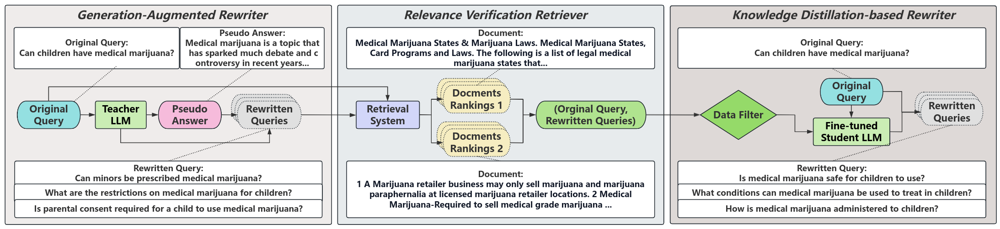

# What is it?
**GaQR** is an efficient generation-augmented question rewriter for retrieval augmented generation(RAG), which reformulates a question into a set of queries through knowledge distillation, and making them more friendly to the search module in RAG.

# How to use it?
Our prompts are detailed below:

1. **Teacher Rewriter** Stage 1: Write a passage that answers the following query: **{Query}**
   
2. **Teacher Rewriter** Stage 2: You are a search engine. Below are a query and its answer: query: **{Query}** answer: **{Answer}**\nIn order to obtain information corresponding to this answer, please provide at least three rewritten queries. Do not answer the rewritten queries. Don't output any words other than the rewritten queries.  

3. **Student Rewriter**: You are a search engine. In order to obtain information for answering the query, please provide at least three rewritten queries. Do not answer the rewritten queries. Don't output any words other than the rewritten queries. The rewritten queries are split by '###'. Below are a query: query: **{Query}**.

# Example  
Teacher Stage 1: Write a passage that answers the following query: What does the legal term demur mean?  

Answer: The legal term demur is defined as a formal objection raised by a party in response to a pleading or motion filed by the opposing party. It indicates that the party does not agree with the claims or arguments presented in the pleading or motion and requests the court to dismiss or strike it... 

Teacher Stage 2: You are a search engine. Below are a query and its answer: query: **{Query in Stage 1}** answer: **{Answer in Stage 1}**\nIn order to obtain information corresponding to this answer, please provide at least three rewritten queries. Do not answer the rewritten queries. Don't output any words other than the rewritten queries.  

Rewritten Quries: 1. What is the purpose of a demurrer in the legal system? 2. How is a demurrer used in civil cases?  3. Can a party challenge the legal sufficiency of a pleading through a demurrer?

Student Stage: You are a search engine. In order to obtain information for answering the query, please provide at least three rewritten queries. Do not answer the rewritten queries. Don't output any words other than the rewritten queries. The rewritten queries are split by '###'. Below are a query: query: **{What does GDP stand for?}**.

Rewritten Quries: 1. What is the meaning of GDP? ### 2. How is GDP calculated? ### 3. Why is GDP an important economic indicator?   
